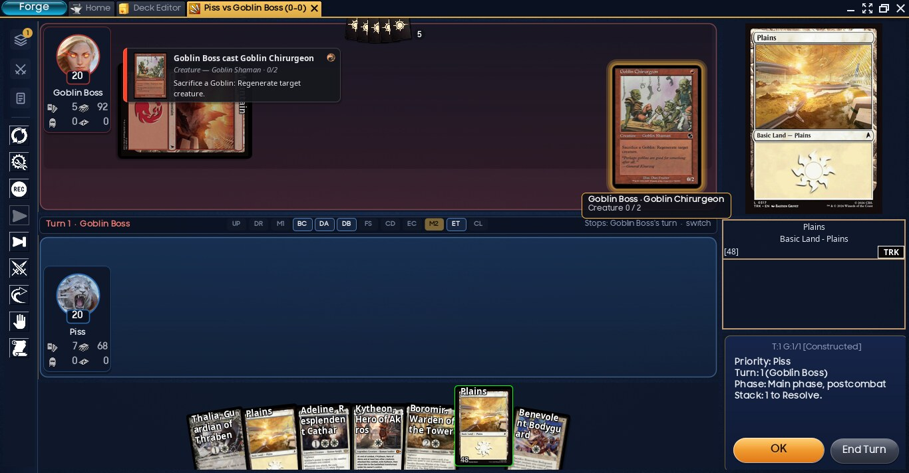
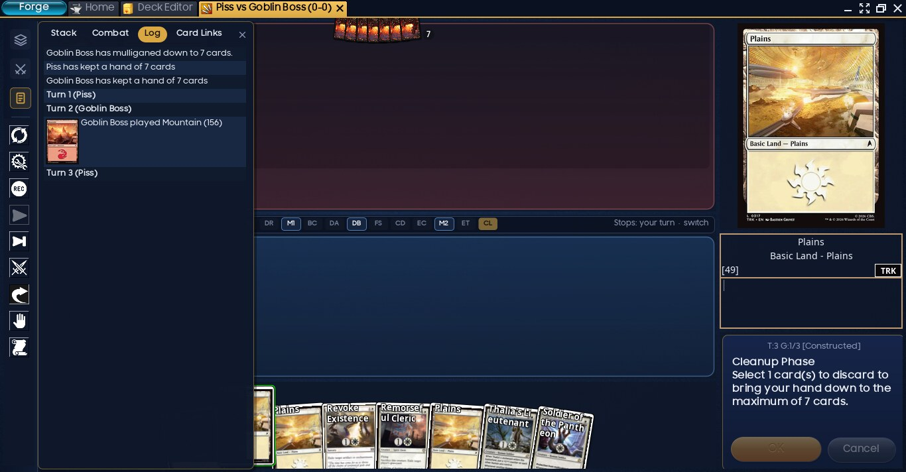
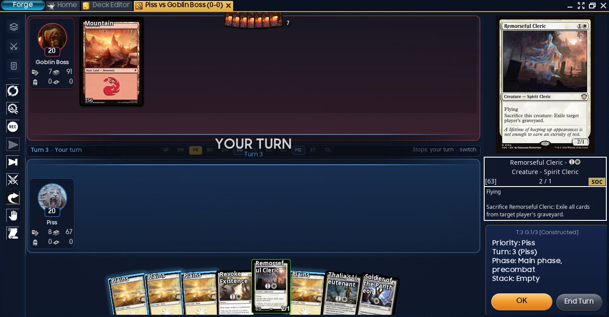

# Forge Arena Mod

A modded build of [Forge](https://github.com/Card-Forge/forge), the free Magic: The Gathering rules engine, with a board-first, Arena-style match screen, friendly mulligans and short play summaries for everything your opponent does.



## Download and play

1. **Install Java 17 or newer.** If you don't have it, get [Temurin](https://adoptium.net) (choose the latest LTS for your system).
2. **Download** `forge-arena-mod-1.2.zip` from the [latest release](../../releases/latest) (about 225 MB) and unzip it anywhere.
3. **Start Forge** from the unzipped folder:
   - **Windows:** double-click `forge.exe`
   - **macOS:** double-click `forge.command`. The first time, right-click it and choose **Open**.
   - **Linux:** run `./forge.sh`
4. Go to **Sanctioned Formats → Constructed**, pick decks and play.

Card images download automatically the first time each card appears, so the first games load a little slower.

### Already have Forge?

Your decks, quest and gauntlet progress, achievements, settings and downloaded card images carry over: Forge keeps them in your user profile, not in the game folder. It's a good idea to back that folder up first:

| System | Decks, settings, progress | Card images |
|---|---|---|
| Windows | `%APPDATA%\Forge` | `%LOCALAPPDATA%\Forge\Cache` |
| macOS | `~/Library/Application Support/Forge` | `~/Library/Caches/Forge` |
| Linux | `~/.forge` | `~/.cache/forge` |

On its first start the mod switches on its own settings once, even if you had chosen something else before: the Navy Gold skin, Friendly mulligan, play summaries, playable-card highlights, tokens in their own row, no update checks, and every Arena-style option. Your player name, decks and all other settings stay as they were. Anything you change afterwards is kept.

If your current Forge is newer than this mod's base version (see below), decks with cards from newer sets may be missing those cards here.

> **Don't use Forge's built-in updater.** It installs stock Forge over this mod. To get a newer version of the mod, download the new zip from this page.

## What's different from stock Forge

Everything below is on by default. Each item can be switched off in **Settings → Preferences**; most switches are in the **Arena-Style Board** section.

**Match screen**
- **Board-first layout:** the battlefields take most of the window.
  - A slim rail on the left holds Stack, Combat and Log (click one to slide it out) plus the tool buttons.
  - The right column shows the card you're looking at and the OK / Cancel buttons.
- **Player plates:** each board has a round avatar with a life badge, plus hand, library, graveyard and exile counts. Mana and counters like poison appear only when you have some.
- **One phase bar** between the boards, showing whose turn it is.
  - Click a step to stop there, as in stock Forge. Stops are kept separately for each player's turn.
  - Use **switch** to edit another player's stops.
- **Navy Gold skin.** Other skins are under Graphic Options → Choose Skin.

**While you play**
- **Play summaries:** when an opponent casts a spell, activates an ability or plays a nonbasic land, a short card slides in and fades by itself. Summaries use plain wording ("Deals 3 damage to you") with short keyword explanations. Hover to pause and see the full card; click to dismiss.
- **Stack as cards:** spells waiting to resolve appear as cards on the board. Hover to see through them.
- **Fanned hand:** the card under your mouse rises to full view.
- **Glowing playable cards**, a **turn banner**, and **floating life changes** (+2 / −3) over the avatars.
- **Opponent's hand** shown as card backs with a count.
- **Play-mats and depth:** blue and red tinted play-mats, card shadows, and dimmed tapped permanents.

**Rules and settings**
- **Friendly mulligan:** mulligan as often as you like and always draw a full 7, with nothing put on the bottom. AI opponents stop after 3. You can switch back to London or another rule in Settings → Gameplay → Mulligan Rule.
- **Commander damage switch:** Settings → Gameplay → **Commander Damage Loss** (on by default). Turn it off and 21 combat damage from one commander no longer knocks a player out; the damage is still counted and shown. In online games, the host's setting applies to everyone.
- **Settings page:** a search box and section buttons that stay at the top while you scroll.




## Playing with friends online

Forge has built-in network play (**Online Multiplayer → Lobby**). Everyone should play with this same download, since mixing versions causes problems.

- **Host:** start the lobby and share your address. The host usually needs to forward TCP port 36743 (changeable in Settings → Server Preferences), or everyone can join the same LAN or a VPN such as Tailscale or ZeroTier.
- **Everyone else:** join with the host's address.

Forge itself still marks network play as a work in progress, so expect the occasional disconnect. The unzipped folder includes Forge's full guide at `docs/Network-Play.md`.

## Good to know

- **Base version:** Forge **2.0.15-SNAPSHOT** (build of 2026-09-06, commit [`53a1037`](https://github.com/Card-Forge/forge/commit/53a103721d627ecb76a2ea52b2febe894844f288)).
- **What's included:** the regular desktop client only. Adventure mode and the mobile-style client aren't in the zip.
- **Where your data goes:** settings, decks and downloaded card images are stored in your user profile (for example `~/.forge` and `~/.cache/forge` on Linux), not in the game folder. Replacing the folder with a newer mod version keeps them.
- **Stock-style screen:** to go back to the classic panel layout, turn off **Board-First Match Layout**; the change applies from the next game.

## Source code

Forge is licensed under the GNU GPL v3, and so is this mod (see [LICENSE](LICENSE)). All changes are published here:

| Path | What it contains |
|---|---|
| `patches/` | The Java changes as `git format-patch` files, to apply on top of Forge commit `53a1037` |
| `res-patches/` | Wording changes to `res/languages/en-US.properties`, and `res/defaults/window.xml` so a first start opens maximized |
| `skins/navy_gold/` | The Navy Gold skin, which goes in `res/skins/navy_gold/` |
| `tools/make_navy_gold.py` | Script that generates the skin (needs Python 3 and Pillow) |

To build from source:

```sh
git clone https://github.com/Card-Forge/forge.git
cd forge
git checkout -b arena-mod 53a103721d627ecb76a2ea52b2febe894844f288
git am /path/to/forge-arena-mod/patches/*.patch
git apply --directory=forge-gui /path/to/forge-arena-mod/res-patches/*.patch
mkdir -p forge-gui/res/skins/navy_gold
cp /path/to/forge-arena-mod/skins/navy_gold/* forge-gui/res/skins/navy_gold/
```

Then build with Maven as described in [Forge's development docs](https://github.com/Card-Forge/forge/wiki).

All credit for Forge itself goes to the [Forge team and contributors](https://github.com/Card-Forge/forge/graphs/contributors). This mod is not affiliated with Wizards of the Coast.
